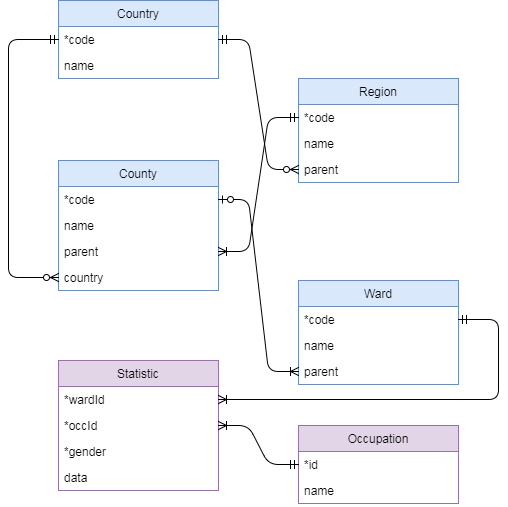

# SQL Queries

This week's exercises use two databases: the results from the 2014
elections in Bristol, and the 2021 UK census.

For each question try and answer it with a single SQL query (with as
many joins and subqueries as you deem necessary).  Don't hard code
indices, instead try and join with other tables and use names.

You can load each database directly in SQLite (`sqlite3 Elections.db`
or `sqlite3 Census.db`) or use the `.open` command to load them all at runtime.

## Easier Questions
### Elections

1. List the names of all parties that stood in the election, ordered alphabetically by name.

2. List the names of all parties that stood in the Bedminster ward.

3. How many votes did Labour get in the Stockwood ward?

4. List the names, parties and number of votes obtained for all candidates in the Southville ward. Order the candidates by number of votes obtained descending (winner comes first).

5. List the name, party and number of votes obtained for the winner only in the Knowle ward.

## Census

1. The university of Bristol is situated in the Cabot ward (ward names are not always distinct, but this one is). Find the names and codes of the CLU, region and country containing the Cabot ward (CLU = county level unit = "row in County table").

2. Find the number of women managers in the Cabot ward. 

3. For the Stoke Bishop ward, list the 9 occupation class names and the number of men in each occupation. Your table should have two columns called name and number. 

## Harder Questions
### Elections

1. How many votes were cast in all of Bristol in the 2014 elections?
2. How many votes were cast in the 'Windmill Hill' ward and what percentage of the electorate in this ward does this represent? Your statement should produce a table with one row and two columns called 'votes' and 'percentage'.
3. List the names, parties and percentage of votes obtained for all candidates in the Southville ward. Order the candidates by percentage of votes obtained descending.
4. How successful (in % of votes cast) was the Conservative party in each ward?
5. Which rank did Labour end up in the 'Whitchurch Park' ward? Your statement should produce a table with a single row and column containing the answer as a number. You can assume no ties.
6. What is the total number of votes that each party got in the elections? Your result should be a table with two columns party, votes.
7. Find all wards where the Green party beat Labour and create a table with two columns ward, difference where the difference column is the number of Green votes minus the number of Labour votes. Your table should be ordered by difference, with the highest one first.

### Census

1. How many women work in sales and customer service occupations and live in the Cabot ward of Bristol?
2. How many people work in sales and customer service occupations and live in the Cabot ward of Bristol?
3. How many people work in caring, leisure and other service occupations in all of the City of Bristol CLU?
4. In the Cabot ward, produce a table listing the names of the 9 occupation classes and the number of people in each of the classes in this ward.
5. Find the working population, ward name and CLU name for the smallest ward (by working population) in the 2011 census.
6. The same as the last question, but now produce a table with two rows, one for the smallest and one for the largest ward. There's no quicker way than repeating the last query twice, the question is how to stick the two "copies" together.
7. Find the average size of a ward's working population in the London region.
8. The same as the last question but now for every region—your query should produce a table with one row per region. 
9. Produce a table that lists, for each of the 9 regions of England, the percentage of people in managerial occupations who are women.
10. For all CLUs in the London region, produce a table with three columns called CLU, occupation and count such that:
  - CLU is the CLU name.
  - count is the number of people of the occupation class in question in the given CLU.
  - occupation is the name of the occupation class.
  - Only rows with count >= 10000 appear in the table.
  - The table is sorted by count ascending.
11. Create a table with three columns occupation, women and men and one row per occupation class. The occupation column should list the occupation class names. The women and men columns in each row should list the total number of women resp. men in the row's occupation class in the whole dataset. The intention here is not to have to copy-paste a subquery 9 times.
12. The same as question 9, but now with a 10th row in the table listing the value for all of England. You can use the string 'England' for the region column.
